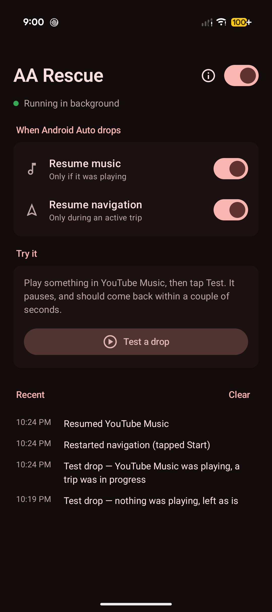
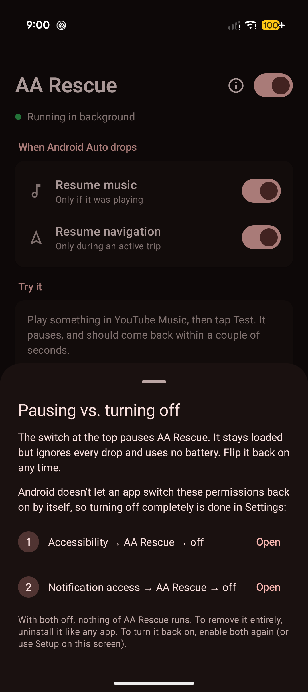

# AA Rescue

When a wireless Android Auto screen drops mid-drive, Android pauses your music and
Google Maps falls out of navigation. AA Rescue notices the drop and puts things back:

- **Music** — presses play again, but only if it was playing when the screen dropped.
- **Navigation** — brings Google Maps forward and taps **Start**, but only during an active trip.

Nothing that was off gets turned on. Both behaviors can be toggled, and the switch at
the top pauses everything. Timings (reaction delay, how long to keep music playing, how long
to wait for an unlock, etc.) are adjustable under **Timing**.

<p align="center">
  
  &nbsp;&nbsp;
  
</p>

## Privacy

- **No internet permission.** Nothing the app sees can leave the phone.
- **Accessibility is scoped to Google Maps.** It only receives events from Maps
  (`res/xml/maps_clicker.xml`), only reads the screen while Maps is the app in front,
  and only acts for ~25 seconds after a drop, looking for a "Start"/"Resume" button.
  Android shows its generic "full control" warning for every accessibility app regardless.
- **Notification access** is used to press play on the music app and to see whether
  Maps has an active trip notification.

## Install

Download the APK from the [latest release](../../releases/latest) (or
`release/aa-rescue-0.1.4.apk` in this repo) to the phone and open it (allow installs from that
source), or with adb:

```sh
adb install -r release/aa-rescue-0.1.4.apk
```

Then open AA Rescue and finish Setup:

1. **Music control** — Notification access → AA Rescue → on.
2. **Maps auto-Start** — Accessibility → AA Rescue → on. If it's greyed out:
   App info → ⋮ → *Allow restricted settings*, then try again.

Tip: if your phone has a PIN, add the car screen's Bluetooth (or your speaker) under
Extend Unlock → Trusted devices, so Maps can be opened after a drop.

The APK is signed with a debug key (personal sideload build, not for the Play Store).

## Build

```sh
./gradlew assembleRelease   # app/build/outputs/apk/release/app-release.apk
```

Read the app's trace log (adb only):

```sh
adb shell dumpsys activity service dev.nish.aarescue/.MediaWatcher
```

End-to-end test with a real Android Auto session (Desktop Head Unit) and a real drop —
see the header of `scripts/e2e.sh` for setup:

```sh
scripts/e2e.sh <adb-serial> music_nav   # music + navigation must come back after the drop
scripts/e2e.sh <adb-serial> nothing     # nothing playing → nothing gets started
```

Fake a drop for testing (adb only):

```sh
adb shell am broadcast -n dev.nish.aarescue/.DebugDropReceiver --ez nav true
```
